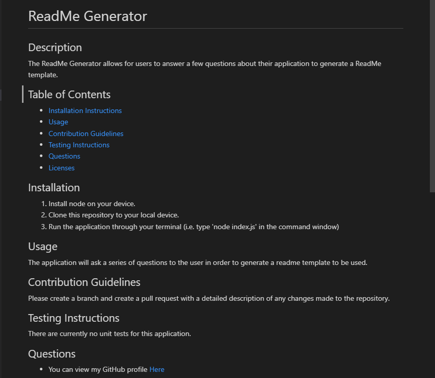

# ReadMe Generator 
## Description

The ReadMe Generator allows for users to answer a few questions about their application to generate a ReadMe template.

## Table of Contents

  * [Installation Instructions](#installation-instructions)
  * [Usage](#usage)
  * [Contribution Guidelines](#contribution-guidelines)
  * [Testing Instructions](#testing-instructions)
  * [Questions](#questions)
  * [Licenses](#licenses)

## Installation Instructions

1. Install node on your device. 
2. Clone this repository to your local device. 
3. Run the application through your terminal (i.e. type 'node index.js' in the command window)

## Usage

The application will ask a series of questions to the user in order to generate a readme template to be used. 

## Contribution Guidelines

Please create a branch and create a pull request with a detailed description of any changes made to the repository.

## Testing Instructions

There are currently no unit tests for this application.

## Questions

  * You can view my GitHub profile [Here](https://github.com/lucasz10)
  * For additonal questions you can send me an [email](mailto:lucas.zach10@gmail.com)

## Sample Screenshot

## Video Demonstration

You can find a sample video [here](https://youtu.be/Tj4X11yUf-w)